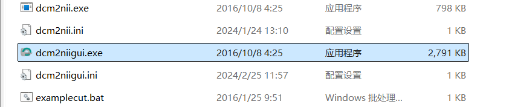
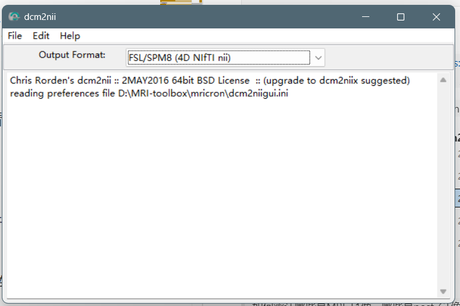
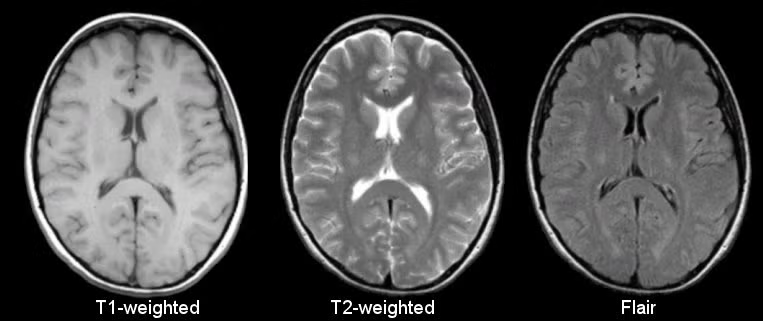
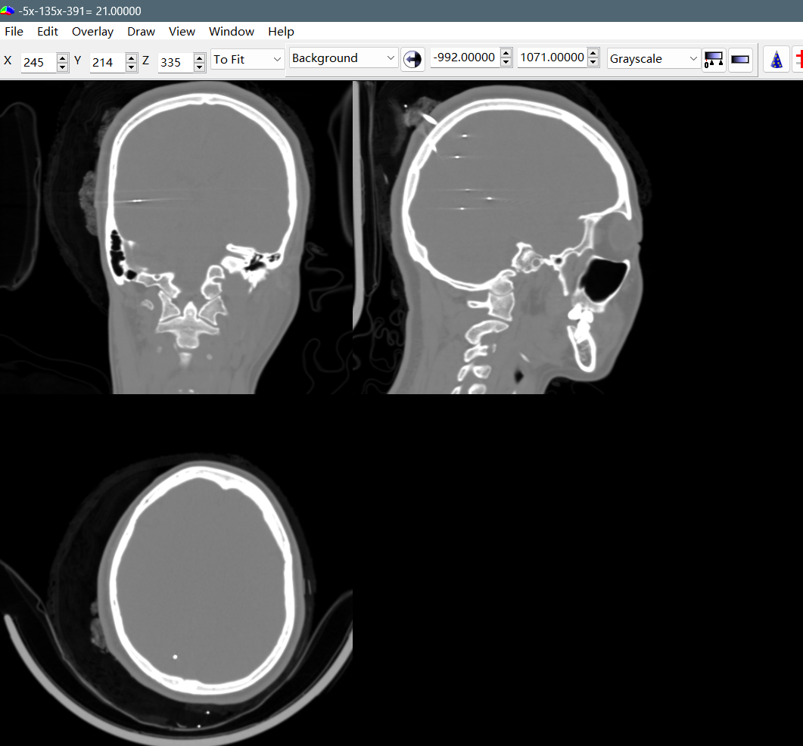
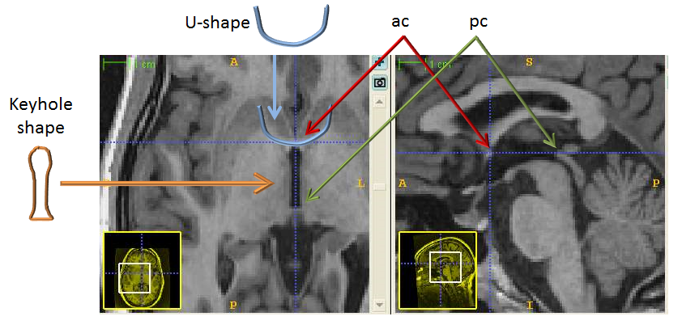
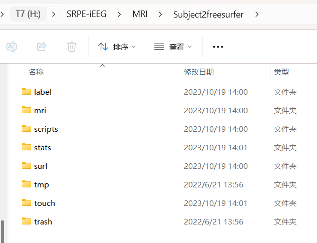

# iEEG颅内数据预处理

> 注意：参考文章比较丰富的内容就简单写写了,个人使用的iEEG数据预处理步骤，仅供参考，欢迎讨论~ 
> @ XiangshuWu 2024/11/12
> 
 

**参考文章**：Stolk, A., Griffin, S., Van Der Meij, R., Dewar, C., Saez, I., Lin, J. J., Piantoni, G., Schoffelen, J.-M., Knight, R. T., & Oostenveld, R. (2018). Integrated analysis of anatomical and electrophysiological human intracranial data. Nature Protocols, 13(7), 1699–1723. https://doi.org/10.1038/s41596-018-0009-6

**Fildtrip Tutorial 网址**：https://www.fieldtriptoolbox.org/tutorial/human_ecog/

**使用工具**：

1. Matlab
2. Matlab toolbox:
   * fieldtrip（主力分析工具包）: https://www.fieldtriptoolbox.org/download/
3. freesurfer（MRI图像预处理）: https://surfer.nmr.mgh.harvard.edu/fswiki/DownloadAndInstall
4. mricron（影像学看图小工具）: https://www.nitrc.org/projects/mricron 

 

**目录**：
 

- [iEEG颅内数据预处理](#ieeg颅内数据预处理)
  - [1.如何在拿到原始数据后迅速检查](#1如何在拿到原始数据后迅速检查)
    - [1.1 颅内电记录检查(Trigger检查)](#11-颅内电记录检查trigger检查)
    - [1.2 结构像检查](#12-结构像检查)
  - [2.预处理：结构像预处理与电极定位](#2预处理结构像预处理与电极定位)
    - [2.0 将MRI-T1配准到acpc空间](#20-将mri-t1配准到acpc空间)
    - [2.1 使用freesurfer对MRI T1进行预处理](#21-使用freesurfer对mri-t1进行预处理)
    - [2.2 结构像其他预处理(更新中)](#22-结构像其他预处理更新中)
    - [2.3 电极点定位:brainstorm版(更新中)](#23-电极点定位brainstorm版更新中)

 

## 1.如何在拿到原始数据后迅速检查

**原始数据清单**：
1. 颅内电记录
    * 被试在实验过程中记录的颅内脑电活动 (格式可能为 .edf)
2. 解剖图像
    * 植入电极前 **T1 MRI** (可能是一个文件夹内，包含多张影像图片)
    * 植入电极后 **CT** (可能是一个文件夹内，包含多张影像图片)
3. 被试详细电极位置记录
4. 行为结果记录
 

### 1.1 颅内电记录检查(Trigger检查)
* 根据个人需求，可能需要检查 Trigger数量、顺序、间隔时间是否如预期：

> **Tools**:  matlab with fieldtrip 
> **Input**:   原始数据(.edf) 
> **Output**: tables & figures  when running ***maker_check_sample.m*** (not saved)

参考脚本（简单用于检查数量、顺序、间隔时间）:

    maker_check_sample.m % samle to check marker 
    marker_Bi2Dec.m % function to generate marker from raw ieeg data

### 1.2 结构像检查
*  下一个**mricron**（可视化看图小工具软件: https://www.nitrc.org/projects/mricron ），主要用于检查MRI T1/CT图像是否**完整、清晰**；如果存在异常，及时与医生联系，索要清晰的图像！

* 建议在这一步把文件夹里面的很多层图像合并到一个nii里面方便后续操作
 

*具体操作如下:*

① 下载好的mricron文件夹里有一个这个软件**dcm2niigui.exe**：

 
② 打开长这样，注意选择**output format**为 **[FSL/SPM8(4D NIfTI nii)]**：

③ 把相关文件夹（MRI/CT）拖进空白处，mricron会自动把同一个大脑的每一层扫描像合并成一个 **.nii** 图像，存回 **原来的文件夹**里
做完这步一般会生成：
*  xxxxx.nii ：**用mricron打开**就能看了
* xxxxx.json ：格式和参数记录

> * MRI_T1.nii 长如图最左边这样
> 
> 
> 
> * CT.nii 长这样
> 
> 

## 2.预处理：结构像预处理与电极定位

### 2.0 将MRI-T1配准到acpc空间
* 因为要对齐MRI和CT像，所以要把这两种图片都对齐到acpc坐标系（参考fildtrip tutorial）；

* 可以先单独将MRI图像对齐到acpc，然后把**耗时间的MRI预处理**跑上。

> **Tools**:  matlab with fieldtrip  
> **Input**:   MRI-T1  
> **Output**:  Subjectx_MR_acpc.nii

    
    mri = ft_read_mri(<path to MRI file>);
    cfg = []; cfg.method = 'interactive'; 
    cfg.coordsys = 'acpc'; 
    mri_acpc = ft_volumerealign(cfg, mri);

    % write the preprocessed anatomical MRI out to file.
    cfg           = []; 
    cfg.filename  = [subjID '_MR_acpc'];
    cfg.filetype  = 'nifti';
    cfg.parameter = 'anatomy';
    ft_volumewrite(cfg, mri_acpc);

参考视频： [Supplementary Video 2](https://static-content.springer.com/esm/art%3A10.1038%2Fs41596-018-0009-6/MediaObjects/41596_2018_9_MOESM7_ESM.mp4)

参考定位点:[ Alignment to Anterior and Posterior Commissure (ACPC)](https://sabre.brainlab.ca/docs/processing/stage3.html)

### 2.1 使用freesurfer对MRI T1进行预处理 
注意：
* 预处理MRI T1结构像，**一个被试大约十几个小时，建议在服务器上跑！**
* freesurfer是基于**linux**系统的，只能在linux系统上使用

> **Tools**: freesurfer(Linux)  
> **Input**:  Subjectx_MR_acpc.nii  
> **Output**:  预处理好的文件夹（可以以被试名字命名）一般包含
>  

*具体操作如下:*

① 连接linux服务器（SZU服务器已安装freesufer，如果在别的linux设备上跑，请提前安装：https://surfer.nmr.mgh.harvard.edu/fswiki/DownloadAndInstall ）

② 打开**终端**

- 使用前配置: (i) freesufer位置; (ii) 输出文件位置

        $ export SUBJECTS_DIR=/opt/fox_cloud/share/app/imaging/freesurfer/7.3.2-1 # <path to freesurfer directory> 
        $ export SUBJECTS_DIR=/home/your_name/fs_image # <path to subject directory: output file>
- 使上面设置的参数生效
  
        $ source $FREESURFER HOME/SetUpFreeSurfer.sh  
- 运行预处理

        $ recon-all -s subject1 -i /path/to/input_image.nii -all 

* **-s subject_id**: 定义一个subject_id，用来标识**输出文件夹的名称**。例如，在 -s subject1 中，subject1 将是生成数据的目录名称，位于 **$SUBJECTS_DIR/subject1**路径下。

* **-i input_image** :  指定**输入文件**的路径（MRI_T1.nii的路径）。例如，-i /path/to/input_image.nii 表示使用 input_image.nii 作为输入。

* **-all**: 执行 recon-all 所有的处理步骤，包括 skull strip、白质分割、皮层表面生成等。-all 参数非常方便，因为它会自动依次执行所有步骤，生成最终结果。

### 2.2 结构像其他预处理(更新中) 

### 2.3 电极点定位:brainstorm版(更新中) 
Protocols文章直接用的是fieldtrip定位，也可以的。区别在于：
* fieldtrip: 手动定位每一个contacts
 * brainstorm: 手动定位的是电极那条直线，确定起点根据contacts间距计算每个contacts位置

> 需要的材料:
> * 被试详细电极位置记录
> * 原始数据.edf（用于读取channel label）
> * freesurfer预处理处理好的**MRI-T1**文件夹
> * **post_CT_acpc.nii**（_acpc指的是两种图像都已经转换到acpc坐标系了）

参考链接: https://blog.csdn.net/valarD/article/details/119419499